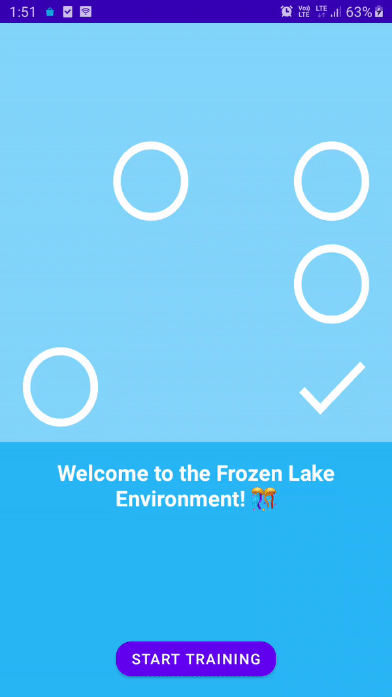

# Q Learning with the Frozen Lake environment in Android

Explore Q Learning with the Frozen Lake Environment 🥶 in Android.
To learn more, Read [Q-Learning With The Frozen Lake Environment In Android](https://heartbeat.fritz.ai/q-learning-with-the-frozen-lake-environment-in-android-937cf48dcc52) on [Medium](https://medium.com/@equipintelligence).

You may see how the app looks like,

